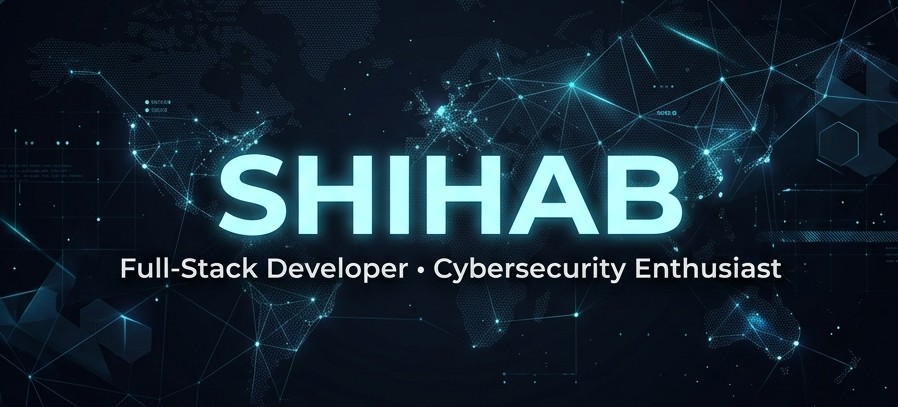

 

  <strong>Transforming complex problems into elegant, secure code.</strong> 
  Exploring the intersection of Web Development, Offensive Security, and System Design.

---

### 🛠️ Tech Stack

#### 💻 Languages & Core

  

#### 🌐 Web Development & Design

  

#### ⚙️ Backend & Infrastructure

  

#### 🛡️ Security & Environment

  

#### 🚀 Cloud, DevOps & Tools

  

---

### 📊 GitHub Insights

<table border="0">
  <tr>
    <td align="center">
      
    </td>
    <td align="center">
      
    </td>
  </tr>
</table>

---

### 📫 Let's Connect

 

  <em>"Stay Anonymous. Stay Secure."</em>

